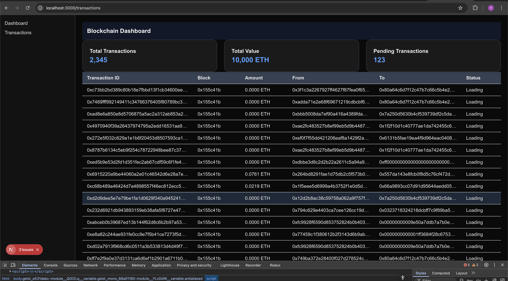
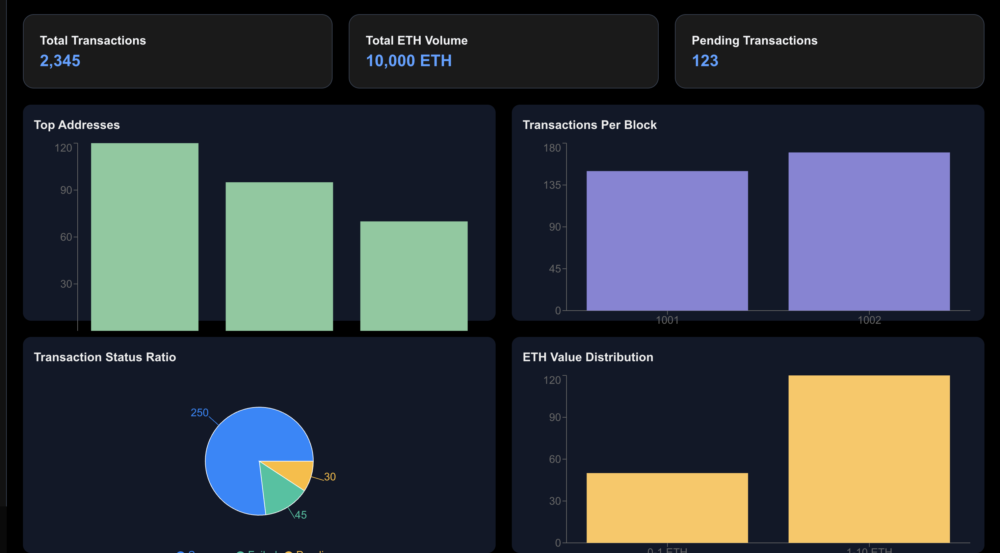

# 🧾 Blockchain Analytics Dashboard

A full-stack blockchain analytics dashboard for tracking Ethereum transactions in real time. It provides insights like total transaction volume, status ratios, top addresses, block metrics, and more.

## ✨ Features

- Real-time Ethereum transaction tracking
- Summary cards (Total Transactions, ETH Volume, Pending Transactions)
- Visual breakdowns:
  - Top active addresses
  - Transactions per block
  - ETH value distribution
  - Transaction status (success, pending, failed)
- Detailed transaction table with:
  - Transaction hash, block, amount
  - Sender, receiver
  - Status (updated live)

## 🗂️ Monorepo Structure

```
/
├── backend/        # Node.js + Express (or other) backend
├── frontend/       # React + Tailwind frontend
├── README.md       # You're here
```

---

## 🚀 Getting Started

### 📦 Prerequisites

- Node.js (v18+ recommended)
- Yarn or npm
- MetaMask / Infura / Alchemy (optional, depending on the provider you use)

---

### 🔧 Setup Instructions

#### 1. Clone the repository

```bash
git clone https://github.com/your-username/blockchain-dashboard.git
cd blockchain-dashboard
```

---

#### 2. Start the Backend

```bash
cd backend
npm install
# or
yarn

# Create a `.env` file with your provider key
cp .env.example .env

# Start the backend server
npm run dev
```

---

#### 3. Start the Frontend

```bash
cd ../frontend
npm install
# or
yarn

# Start the frontend dev server
npm run dev
```

The frontend will typically run at `http://localhost:3000`.

---

## 🖼️ Screenshots

| Transactions Table | Dashboard View |
|----------------|--------------------|
|  |  |

---

## 🤝 Contributing

Pull requests are welcome. For major changes, please open an issue first.

---

## 📄 License

MIT © [Your Name](https://github.com/your-username)
